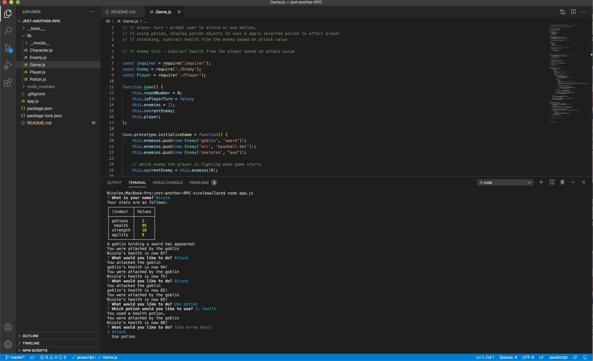

# Jest Another RPG

## Description 
This application is a command-line role-playing game in which a user battles against a series of enemies whose health and stats can be sustained by a potion. This application uses principles of OOP and TDD.
 
## Table of Contents
* [Installation](#installation)
* [Usage](#usage)
* [License](#license)
* [Contributing](#contributing)
* [Tests](#tests)
* [Questions](#questions)

## Installation 
The user should clone the repository from GitHub and download Node. This application also requires the inquirer module. If testing is required, this application uses Jest. 

## Usage 
Use inquirer from your command line to answer questions about your project.

## License 
This project is license under MIT

## Contributing 
Contributors should read the installation section. 

## Tests
Run `npm test` to run Jest for tests on constructors. 

## Questions
If you have any questions about this projects, please contact me directly at nicole.elisaw@gmail.com. You can view more of my projects at https://github.com/nicolewallace09.